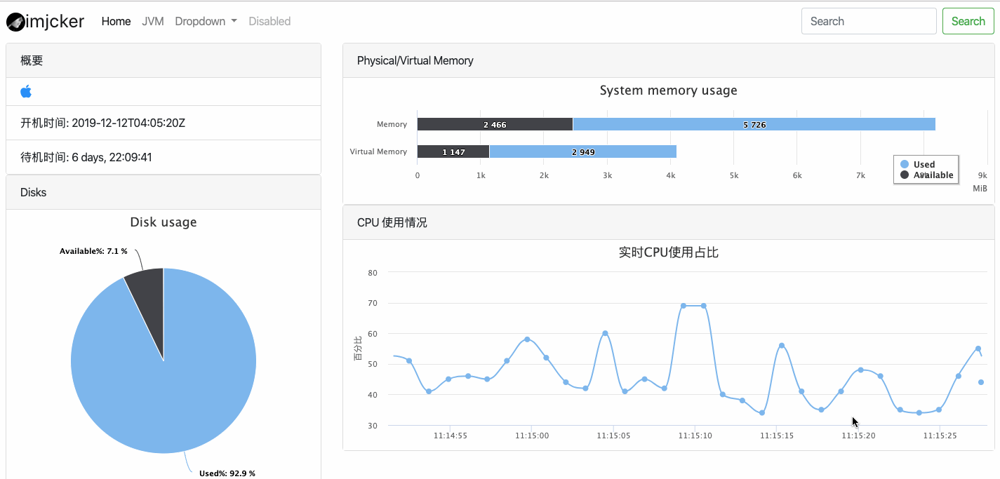

# sys-spring-boot-starter
[][license]
[](https://imjcker.github.io)

live server system information




## docker
run within docker by execute script below.
explanation: run service container as **monitor** and publish port on host server port **8081** or any other available ports you replace with. 
```shell script
sudo docker run -d --name monitor -p 8081:8080 imjcker/sys-spring-boot-starter:latest
```


[license]: https://www.apache.org/licenses/LICENSE-2.0
